  

# Josué Menezes 🕷️👨🏻‍💻

`Software Developer` · `Estudante de ADS na FIAP`

  
  
  

---

## 🕸️ Sobre mim

Olá :)
Me chamo Josué, sou estudante de Análise e Desenvolvimento de Sistemas na FIAP.

Atualmente desenvolvendo skills como Java, Python, Banco de dados, I.a, ChatBot e Business Model 
através da criação de projetos práticos e solucão problemas reais, Também possuo conhecimento em marketing digital e design, o que amplia minha visão sobre produto, experiência do usuário e soluções digitais.

Busco oportunidade para aprender na prática, participar de projetos e evoluir na área de tecnologia.
Aberto a conexões com profissionais de desenvolvimento e inovação.

---

## </> Tech Stack

  

---

## 📊 GitHub Stats

  
  

  

## 📈 Activity Graph

  

  

🕷️ Cards atualizados automaticamente todos os dias.

